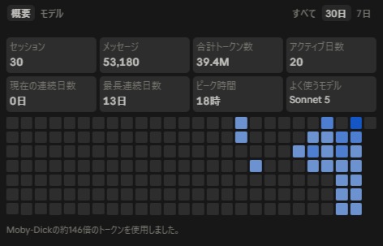
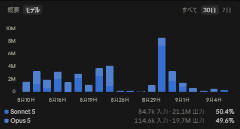

# Claude Codeの実測トークン量から見るコストパフォーマンス

> 要約: 「Claude Pro（$20/月）でClaude Codeをフル活用すると、実際どれくらいの価値を引き出せているのか」を、実測トークン数から逆算する。プロモーションや利用率といった見落としがちな補正要因を挟むことで、単なる「お得感」の感覚論ではなく、再現可能な計算として組み立てることを試みる。

## なぜ実測にこだわるか

Claude Code・Codex CLI・Antigravityのようなコーディングエージェントツールの比較は、機能面やベンチマークスコアでの比較記事は多い。一方で、「定額プランを1ヶ月フル活用した場合に、生トークン数ベースで実際どれだけの価値を引き出せているか」という切り口の一次情報は、探した範囲では見当たらなかった。各社とも公式に公表しているのは「5時間ごと」「週次のセッション回数」といった制限のみで、トークン数ベースの上限は非公開になっている。

そこで、自分自身がClaude Pro（$20/月、Claude Codeのみでの利用、通常のClaudeチャット利用は含まない）を1ヶ月フル活用した際の実測値を起点に、コストパフォーマンスを計算してみることにした。

## 実測データ

測定期間は2026年8月上旬〜9月上旬（直近30日、目安として8/5〜9/5）。数字は自己集計ではなく、Claude Code自体のUsage画面（概要／モデル別）に表示されている値をそのまま使用している。

| 項目 | 値 |
|---|---|
| 対象プラン | Claude Pro（$20/月） |
| 利用経路 | Claude Codeのみ |
| 合計トークン数（概要画面表示） | 39.4M |
| セッション数 | 30 |
| アクティブ日数 | 20/30日 |

モデル別の内訳は以下の通り（画面の表示をそのまま採用）。

| モデル | 入力 | 出力 | 構成比 |
|---|---|---|---|
| Sonnet5 | 84.7k | 21.1M | 50.4% |
| Opus5 | 114.6k | 19.7M | 49.6% |

モデル別の入力・出力を単純合算すると約41.0M（84.7k + 21.1M + 114.6k + 19.7M）になり、概要画面の合計トークン数（39.4M）とは約4%の差がある。原因は不明だが、概要画面側のカウント方法（キャッシュトークンの扱いなど）が内訳側と異なっている可能性がある。以下の補正計算では概要画面の39.4Mを基準値として扱い、小売換算の計算ではモデル別の実測入力・出力をそのまま使う。

なお、入力:出力比は当初「約1:140」という粗い仮定を置いていたが、実測ではSonnet5が約1:249（84.7k→21.1M）、Opus5が約1:172（114.6k→19.7M）と、モデルごとに異なり、かつどちらも仮定よりさらに出力偏重だったことが分かった。

ただし、この数字をそのまま鵜呑みにはできない。測定期間には以下の前提条件が絡んでいるためだ。

- この期間はClaude Codeの週間利用制限+50%増キャンペーン適用中だった（2026年5月13日開始、9月13日まで。9月14日以降は恒久+25%に切替予定）
- 週次上限を毎週100%使い切れていたわけではない。目標としては常に80%以上を使うようにしていたが、100%に届かない週もあった
- リセット直前まで枠を温存する使い方をすると80〜90%で終わりやすく、逆に使い切ろうとすると100%に届くこともある。この往復から、平均利用率は85〜95%程度と仮定するのが妥当と考えている
- 日常のちょっとした利用（Claude Code以外の軽い使用）が少量紛れ込んでいる可能性もある

つまり実測39.4Mは「フル活用時の理論上限」そのものではなく、キャンペーン下・かつ利用率85〜95%という条件下での観測値、と捉える必要がある。

## 補正計算

### 補正1: 利用率を反映した真の上限

実測39.4Mが理論上限の85〜95%だったと仮定すると、真の上限（100%消化時）は次のレンジになる。

- 39.4M ÷ 0.95 ≈ 41.5M（利用率95%だった場合）
- 39.4M ÷ 0.85 ≈ 46.4M（利用率85%だった場合）
- レンジ: 41.5M〜46.4M、中央値 約44.0M（現行+50%増キャンペーン下での真の上限推定）

### 補正2: 恒久プラン（9月14日以降、+25%）への換算

現行は基準100に対して+50%（150%）。9月14日以降は+25%（125%）に切り替わるため、倍率125/150 ≈ 0.833を乗じる。

- 41.5M × 0.833 ≈ 34.6M
- 46.4M × 0.833 ≈ 38.6M
- レンジ: 34.6M〜38.6M、中央値 約36.6M（恒久プラン移行後の真の上限推定）

面白いのは、この2段階の補正（利用率で上振れ、恒久プラン切替で下振れ）を経た中央値（約36.6M）が、補正前の実測値（39.4M）とたまたま近い値に収まっている点だ。プラス方向とマイナス方向の誤差が偶然打ち消し合った結果であり、狙って合わせたわけではない。

## コストパフォーマンス計算

### 実効単価（ブレンド、$20/月ベース）

| シナリオ | トークン数/月 | 実効単価($/Mトークン) |
|---|---|---|
| 実測値（概要画面表示） | 39.4M | $0.51 |
| 現行（+50%）キャンペーン下・真の上限 | 41.5M〜46.4M | $0.431〜$0.482 |
| 恒久プラン（+25%）移行後・真の上限 | 34.6M〜38.6M | $0.518〜$0.578 |

### 小売API価格との比較

2026年9月時点の標準API価格は、Sonnet5が入力$3/M・出力$15/M、Opus5が入力$5/M・出力$25/Mとなっている。今回はモデル別の実測入力・出力（Sonnet5: 84.7k入力・21.1M出力、Opus5: 114.6k入力・19.7M出力）をそのまま使って小売換算すると、Sonnet5分で約$316.75、Opus5分で約$493.07、合計で約$810相当になる。

$20の支払いに対して約$810相当を引き出している計算になり、割引倍率は約40.5倍。利用率・プロモーション補正を加味した真の上限レンジ（34.6M〜46.4M）まで含めて考えると、約34〜46倍のレンジに収まる。

## 他社比較における制約

Claude Codeについては上記の通り実測ベースの数字を出せたが、ChatGPT Plus（Codex）やGoogle AI Pro（Antigravity）については同等の精度の実測データが存在しない。各社とも利用制限を「5時間/週次のセッション回数」でのみ公表しており、生トークン数ベースの上限は非公開だからだ。Web検索で調べた範囲でも、3社を同一方法論（月間フル活用時の実測トークン数→$/トークン算出）で比較した一次情報は見つからなかった。

間接的な状況証拠として、GitHub issuesにChatGPT Plus利用者が「数分で5時間枠を使い切る」「1会話（入力約150万トークン）で上限到達」と報告している例が複数あり、Plusの実効スループットがClaude Proの実測39.4M/月より低い可能性を示唆してはいる。ただし確定的な数字ではなく、あくまで参考情報にとどまる。

参考として、他社モデルの2026年9月時点のAPI価格（あくまで小売価格であり、実測スループットではない点に注意）は以下の通り。

| モデル | 入力$/M | 出力$/M | 1:140混合時のブレンド単価 |
|---|---|---|---|
| GPT-5.6 Sol | $5 | $30 | $29.82 |
| GPT-5.6 Terra | $2 | $12 | $11.93 |
| GPT-5.6 Luna | $0.20 | $1.20 | $1.19 |
| Gemini 3 Pro | $2 | $12 | $11.93 |
| Gemini 3.8 Flash | $0.75 | $3.75 | $3.73 |

Claude・OpenAI・Google間でAPI単価そのものが異なるため、「同じ約39Mトークンを他社でも引き出せた場合」という仮定計算は可能だが、実際にそのプランでその量を引き出せるかどうかは別問題である。また単価が安いGemini系のモデルは、同じトークン数を引き出せたとしても「小売換算の割引倍率」という指標では小さく出てしまう点には注意したい（単価が安いこと自体はもちろん良いことである）。

## 今後の展望

- Codex CLI（ChatGPT Plus、無料トライアル中に検証）・Antigravity（Google AI Pro）でも同一方法論（1ヶ月フル活用してトークン数を記録）を実施し、同条件での比較を完成させたいと考えている。ただしフル活用と計測を並行して行うのは負荷が高く、実施するかどうかは未定
- 今後同様の計測を行う際は、測定期間中に適用されていたプロモーションの有無、週次/セッション上限に対する実際の利用率、使用モデルの内訳比率、対象がCLIツール限定か通常チャット利用を含むかを必ず記録・明記する
- この種の数字は陳腐化しやすいため、価格やプロモーションが変わった場合は追記・更新する前提で捉えている

---

※本記事の実測値・補正値は2026年9月時点のプラン条件・API価格に基づく。プロモーション終了や価格改定により数値は変動しうる。
