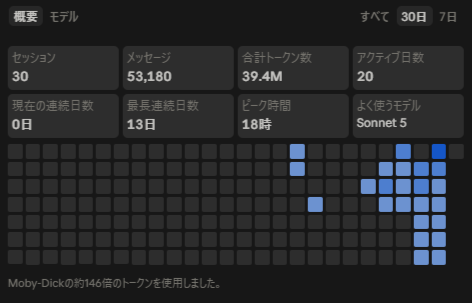
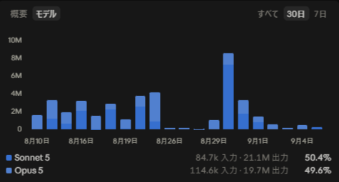

# Claude Codeの実測トークン量から見るコストパフォーマンス

> 要約: 「Claude Pro（$20/月）でClaude Codeをフル活用すると、実際どれくらいの価値を引き出せているのか」を、実測トークン数から逆算する。プロモーションや利用率といった見落としがちな補正要因を挟むことで、単なる「お得感」の感覚論ではなく、再現可能な計算として組み立てることを試みる。

## なぜ実測にこだわるか

Claude Code・Codex CLI・Antigravityのようなコーディングエージェントツールの比較は、機能面やベンチマークスコアでの比較記事は多い。一方で、「定額プランを1ヶ月フル活用した場合に、生トークン数ベースで実際どれだけの価値を引き出せているか」という切り口の一次情報は、探した範囲では見当たらなかった。各社とも公式に公表しているのは「5時間ごと」「週次のセッション回数」といった制限のみで、トークン数ベースの上限は非公開になっている。

そこで、自分自身がClaude Pro（$20/月、Claude Codeのみでの利用、通常のClaudeチャット利用は含まない）を1ヶ月フル活用した際の実測値を起点に、コストパフォーマンスを計算してみることにした。

## 実測データ

測定期間は2026年8月上旬〜9月上旬（直近30日、目安として8/5〜9/5）。数字は自己集計ではなく、Claude Code自体のUsage画面（概要／モデル別）に表示されている値をそのまま使用している。

| 項目 | 値 |
|---|---|
| 対象プラン | Claude Pro（$20/月） |
| 利用経路 | Claude Codeのみ |
| 合計トークン数（概要画面表示） | 39.4M |
| セッション数 | 30 |
| アクティブ日数 | 20/30日 |

モデル別の内訳は以下の通り（画面の表示をそのまま採用）。

| モデル | 入力 | 出力 | 構成比（画面表示） |
|---|---|---|---|
| Sonnet5 | 84.7k | 21.1M | 50.4% |
| Opus5 | 114.6k | 19.7M | 49.6% |

モデル別の入力・出力を単純合算すると約41.0M（84.7k + 21.1M + 114.6k + 19.7M）になり、概要画面の合計トークン数（39.4M）とは約4%の差がある。また、この単純合算から算出される構成比はSonnet5 約51.7%・Opus5 約48.3%となり、画面表示の50.4%/49.6%とも僅かに異なる。原因は不明だが、概要画面側のカウント方法（キャッシュトークンの扱いなど）やUI側の集計仕様が、モデル別内訳の単純合算とは異なっている可能性がある。以下の補正計算では概要画面の39.4Mを基準値として扱い、小売換算の計算ではモデル別の実測入力・出力をそのまま使う（構成比の列は画面表示値をそのまま記載したもの）。

なお、入力:出力比は当初「約1:140」という粗い仮定を置いていたが、実測ではSonnet5が約1:249（84.7k→21.1M）、Opus5が約1:172（114.6k→19.7M）と、モデルごとに異なり、かつどちらも仮定よりさらに出力偏重だったことが分かった。入力がここまで少なく出力に極端に偏っている背景には、Claude Code内部で効いているプロンプトキャッシュ（過去の会話やファイル内容を毎回送り直さずキャッシュから再利用する仕組み）により、キャッシュ読み込み分がこの画面上の「入力」カウントに含まれていない、あるいは別枠で扱われている可能性が考えられる。以降の小売換算は、画面表示の入力・出力トークンをそのまま通常単価で乗算した概算であり、実際のAPI課金で適用されるキャッシュ読み込み・書き込みの割引価格は考慮していない点に注意されたい。

ただし、この数字をそのまま鵜呑みにはできない。測定期間には以下の前提条件が絡んでいるためだ。

- この期間はClaude Codeの週間利用制限+50%増キャンペーン適用中だった（2026年5月13日開始、9月13日まで。9月14日以降は恒久+25%に切替予定）
- 週次上限を毎週100%使い切れていたわけではない。目標としては常に80%以上を使うようにしていたが、100%に届かない週もあった
- リセット直前まで枠を温存する使い方をすると80〜90%で終わりやすく、逆に使い切ろうとすると100%に届くこともある。この往復から、平均利用率は85〜95%程度と仮定するのが妥当と考えている
- 日常のちょっとした利用（Claude Code以外の軽い使用）が少量紛れ込んでいる可能性もある
- ここで示す数字は2026年8月という特定の1ヶ月のスナップショットであり、タスクの種類・メッセージの長さ・モデル選択などの使い方次第で月ごとに変動しうる。毎月必ずこの水準のトークン数を引き出せることを保証するものではない

つまり実測39.4Mは「フル活用時の理論上限」そのものではなく、キャンペーン下・かつ利用率85〜95%という条件下での観測値、と捉える必要がある。

また、この変動要因は利用者自身の使い方だけによるものではない。Anthropic側の計算資源供給状況に応じて、利用制限の制度自体が変更されることがあり、過去1年で利用制限は5回前後変更されている（週次上限の新設 → ピーク時間帯制限 → 5時間上限の恒久倍増 → 週間+50%キャンペーン → 恒久+25%、という推移）。本記事の実測値は、このうち計算資源が増強された直後という、相対的に緩和されたタイミングでの測定である点に留意したい。単に「自分と同じくらい酷使すれば同じ数字が出る」という話ではなく、運営側の制度自体がいつでも変わりうる、という不確実性も含んでいる。

## 補正計算

### 補正1: 利用率を反映した真の上限

実測39.4Mが理論上限の85〜95%だったと仮定すると、真の上限（100%消化時）は次のレンジになる。

- 39.4M ÷ 0.95 ≈ 41.5M（利用率95%だった場合）
- 39.4M ÷ 0.85 ≈ 46.4M（利用率85%だった場合）
- レンジ: 41.5M〜46.4M、中央値 約44.0M（現行+50%増キャンペーン下での真の上限推定）

### 補正2: 恒久プラン（9月14日以降、+25%）への換算

現行は基準100に対して+50%（150%）。9月14日以降は+25%（125%）に切り替わるため、倍率125/150 ≈ 0.833を乗じる。

- 41.5M × 0.833 ≈ 34.6M
- 46.4M × 0.833 ≈ 38.6M
- レンジ: 34.6M〜38.6M、中央値 約36.6M（恒久プラン移行後の真の上限推定）

面白いのは、この2段階の補正（利用率で上振れ、恒久プラン切替で下振れ）を経た中央値（約36.6M）が、補正前の実測値（39.4M）とたまたま近い値に収まっている点だ。プラス方向とマイナス方向の誤差が偶然打ち消し合った結果であり、狙って合わせたわけではない。

## コストパフォーマンス計算

### 実効単価（ブレンド、$20/月ベース）

| シナリオ | トークン数/月 | 実効単価($/Mトークン) |
|---|---|---|
| 実測値（概要画面表示） | 39.4M | $0.51 |
| 現行（+50%）キャンペーン下・真の上限 | 41.5M〜46.4M | $0.431〜$0.482 |
| 恒久プラン（+25%）移行後・真の上限 | 34.6M〜38.6M | $0.518〜$0.578 |

### 小売API価格との比較

換算に使う単価は、Sonnet5が入力$2/M・出力$10/M、Opus5が入力$5/M・出力$25/Mである。

> 訂正（2026-10-02）: 当初この節では「Sonnet5の$2/$10は2026年8月31日までの導入価格で、9月1日以降は標準価格の$3/$15に切り替わっている」と書いていた。その後公式の価格ページを確認したところ、予定されていた値上げは行われず、$2/$10がそのまま標準価格になっていた。これに合わせて、$3/$15を仮定した参考計算（約$810・約40.5倍）を削除した。以下の約$704・約35.2倍は当初から$2/$10で計算しており、数値に変更はない。

この単価（Sonnet5: $2/$10、Opus5: $5/$25）でモデル別の実測入力・出力（Sonnet5: 84.7k入力・21.1M出力、Opus5: 114.6k入力・19.7M出力）を小売換算すると、Sonnet5分で約$211.17、Opus5分で約$493.07、合計で約$704相当になる。

$20の支払いに対して約$704相当を引き出している計算になり、割引倍率は約35.2倍。利用率・プロモーション補正を加味した真の上限レンジ（34.6M〜46.4M）まで含めて考えると、約30〜40倍のレンジに収まる。

なお、ここで示す小売換算価値・割引倍率は、いずれもあくまでAPI従量課金と比較した場合の相対的な経済性指標であり、Claude Proの利用によって毎月その金額の現金価値を実際に得ている、という意味ではない。

## 他社比較における制約

Claude Codeについては上記の通り実測ベースの数字を出せたが、ChatGPT Plus（Codex）やGoogle AI Pro（Antigravity）については同等の精度の実測データが存在しない。各社とも利用制限を「5時間/週次のセッション回数」でのみ公表しており、生トークン数ベースの上限は非公開だからだ。Web検索で調べた範囲でも、3社を同一方法論（月間フル活用時の実測トークン数→$/トークン算出）で比較した一次情報は見つからなかった。

間接的な状況証拠として、GitHub issuesにChatGPT Plus利用者が「数分で5時間枠を使い切る」「1会話（入力約150万トークン）で上限到達」と報告している例が複数あり、Plusの実効スループットがClaude Proの実測39.4M/月より低い可能性を示唆してはいる。ただし確定的な数字ではなく、あくまで参考情報にとどまる。

参考として、他社モデルの2026年9月時点のAPI価格（あくまで小売価格であり、実測スループットではない点に注意）は以下の通り。なお、ブレンド単価は本記事前半で当初の粗い実測値として置いていた「1:140」比率（30日間の利用実績を最初に確認した際の比率）をそのまま目安として採用しており、後から判明したモデル別の正確な比率（1:172〜1:249）ではない。実測比率（さらに出力偏重）で計算し直した場合もブレンド単価が出力単価にわずかに近づくだけで、大小関係は変わらない。

| モデル | 入力$/M | 出力$/M | 1:140混合時のブレンド単価 |
|---|---|---|---|
| GPT-5.6 Sol | $5 | $30 | $29.82 |
| GPT-5.6 Terra | $2 | $12 | $11.93 |
| GPT-5.6 Luna | $0.20 | $1.20 | $1.19 |
| Gemini 3 Pro | $2 | $12 | $11.93 |
| Gemini 3.8 Flash | $0.75 | $3.75 | $3.73 |

Claude・OpenAI・Google間でAPI単価そのものが異なるため、「同じ約39Mトークンを他社でも引き出せた場合」という仮定計算は可能だが、実際にそのプランでその量を引き出せるかどうかは別問題である。また単価が安いGemini系のモデルは、同じトークン数を引き出せたとしても「小売換算の割引倍率」という指標では小さく出てしまう点には注意したい（単価が安いこと自体はもちろん良いことである）。

## 今後の展望

- Codex CLI（ChatGPT Plus、無料トライアル中に検証）・Antigravity（Google AI Pro）でも同一方法論（1ヶ月フル活用してトークン数を記録）を実施し、同条件での比較を完成させたいと考えている。ただしフル活用と計測を並行して行うのは負荷が高く、実施するかどうかは未定
- 今後同様の計測を行う際は、測定期間中に適用されていたプロモーションの有無、週次/セッション上限に対する実際の利用率、使用モデルの内訳比率、対象がCLIツール限定か通常チャット利用を含むかに加えて、測定期間中に実際に適用されていたAPI単価（導入価格の有無・切替時期）も必ず記録・明記する。価格改定の予定は変更されることがあるため、告知ではなく、参照時点の公式価格ページを確認する
- この種の数字は陳腐化しやすいため、価格やプロモーションが変わった場合は追記・更新する前提で捉えている

## 追記（2026-09-19）: Usage画面の「合計トークン数」にキャッシュ分が含まれるようになった可能性

本記事の公開後、9月中旬に同じUsage画面（直近30日）を確認したところ、「合計トークン数」の桁が大きく変わっていた。

| 項目 | 本記事の測定時（8月上旬〜9月上旬） | 9月19日時点の直近30日 |
|---|---|---|
| 概要画面の合計トークン数 | 39.4M | 10.7B |
| モデル別の入力＋出力の単純合算 | 約41.0M | 約46.2M |
| 合計 ÷ 入出力合算 | 約0.96倍 | 約232倍 |

新しい画面では、モデル別の内訳（Sonnet5・Opus5・Fable5.1の入力と出力）を足しても約46Mにしかならない。一方で合計トークン数は10.7Bで、差の約10.6Bは入出力の表示に現れていない分、つまりキャッシュの読み込み・書き込み分と考えるのが自然である。日別グラフも1日あたり1〜1.7Bと、入出力だけでは説明できない規模になっている。一方、本記事の測定時は合計と入出力合算がほぼ一致していたため、当時の集計にはキャッシュ分が入っていなかったと考えられる。なお、モデル別の入力・出力の表示自体は従来どおりで、キャッシュ分は合計トークン数にだけ加算されているように見える。

これは画面の数字からの推測であり、Anthropic側の公式な仕様変更の告知を確認したものではない。ただし、次の点は本記事の読み方に影響する。

- 本記事の39.4Mや、そこから算出した実効単価・補正計算は、キャッシュを除いた旧基準の値である。新しい画面の合計トークン数（10.7Bなど）と直接比較してはいけない
- 小売換算（約$704相当など）は、もともとモデル別の入力・出力をそのまま乗算したものなので、この表示変更の影響を受けない
- 上の「入力がここまで少ない背景」に書いたキャッシュに関する推測は、この確認により裏付けられた形になる
- 今後同様の計測を行う際は、合計トークン数にキャッシュ分が含まれているかどうかも、測定期間・価格と並べて記録する

なお、この9月19日時点の数字（10.7B）は、Claude Proの利用枠だけを表すものではない。この期間にはFableモデルを追加クレジット（約$85分）で利用しており、その分のトークンも合計に含まれている。また、集計期間も本記事の測定期間とは一致していない。したがって、この合計値はあくまで参考値として扱う。

もう一点、Usage画面の数字はデスクトップPC上での利用を集計したものである。それ以外の環境でもClaude Codeを少量使っているため、本記事の実測値は実際の利用量よりやや少なく出ている。

## 追記（2026-10-02）: Antigravityの5時間枠1回分の換算

Antigravity（Google AI Pro）について、1ヶ月の実測ではないが、5時間枠を1回使い切った際のログからAPI価格への換算を行った。本記事とは計測方法が異なるため、別記事として [Antigravityの5時間枠1回分をAPI価格に換算する](./05_antigravity_quota_cost_analysis.md) にまとめている。キャッシュ分を含めた両者の比較は [AIサブスクリプションの利用枠をAPI価格で並べる（まとめ）](./06_ai_subscription_quota_summary.md) を参照。

---

※本記事の実測値は、2026年8月時点・週間利用制限+50%増キャンペーン下でのClaude Proという特定条件における1ヶ月分の結果であり、毎月同じ水準のトークン数を使えることを約束するものではない。小売換算価値はSonnet5を$2/$10、Opus5を$5/$25として計算しており、その他の補正値・プラン条件は2026年9月時点のものに基づいている。プロモーション終了や価格改定により数値は変動しうる。
